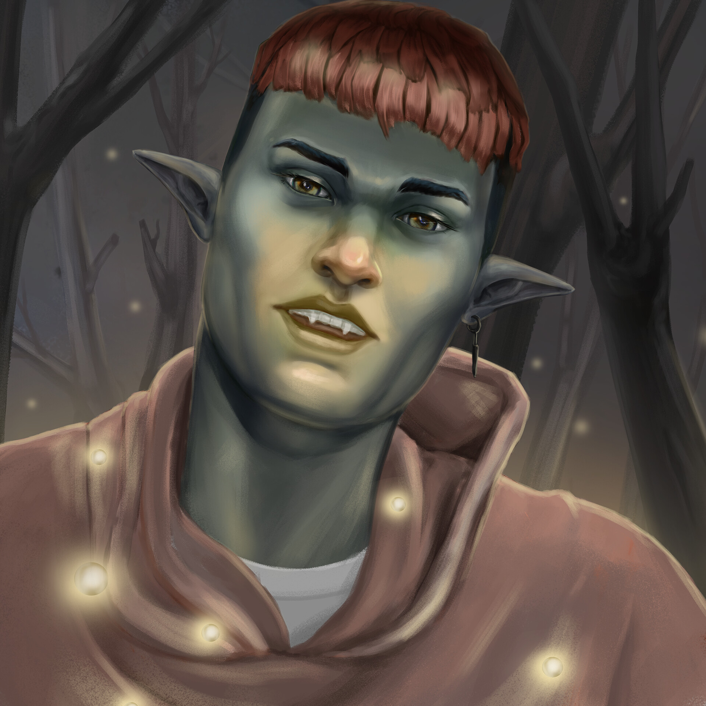
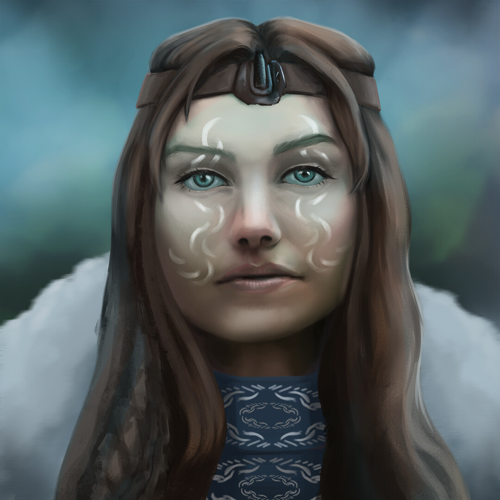

# Jerad Beauregard's Markdown Portfolio #

Hello and welcome to my portfolio page.

## About me ##

Like many artists I have been drawing for a long time. I received formal studio training in
traditional arts during my undergraduate bachelor's degree in Fine Arts. While studying Painting
and Drawing I used theoretical knowledge gained through reading and writing, mixed with
vigorous figurative training, to form a studio practice which works heavily with concepts of
technology and Cyborg theory. After completion of my undergraduate degree I supplemented
my education with a Post-Graduate Certificate in Concept Art for Entertainment Design from
George Brown College. During this Post-Graduate Certificate I received intense studio training
in digital concept development from industry professionals.

Currently I have delved into the world of web development. In my development practice I enjoy mixing the 
skills I learned in design with the analytical thinking it takes to code. In the future I would like to work on
projects that have a mixture of art and coding. Bonus points for projects that include uplifting content or sponser
free or open source education.

## Gallery ##
| | |
|------------------------|---------------------------|
| |  |

